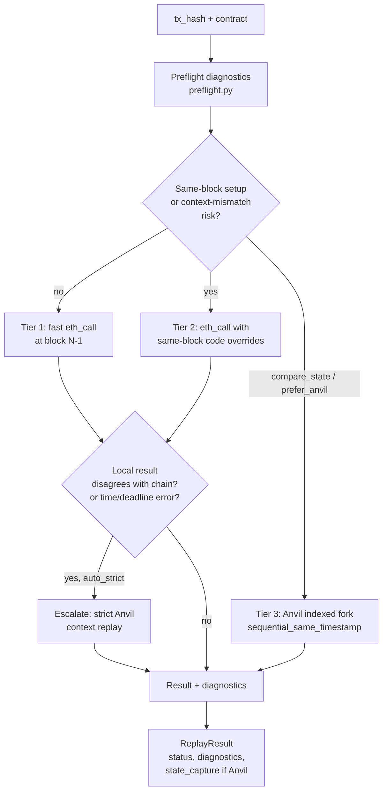
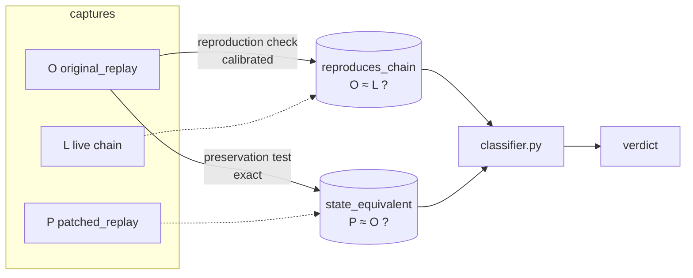
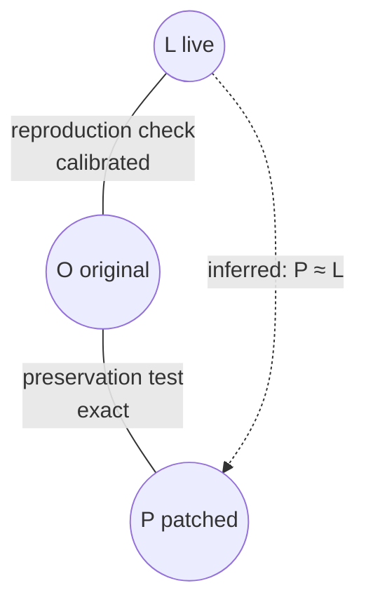
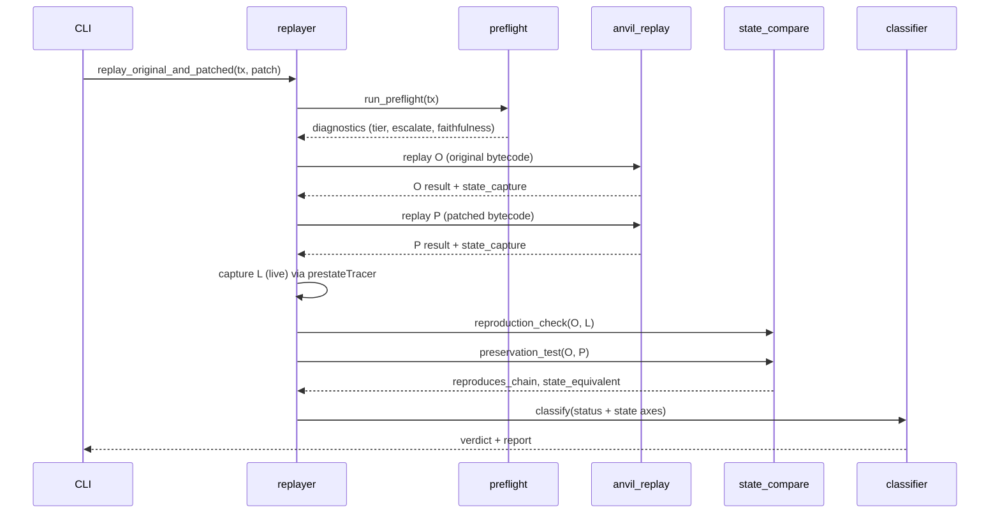

# PonDeReplay architecture: how replay & comparison work

This document describes the *architecture* of PonDeReplay — **how** a transaction is
replayed, **how** two replays are compared, and **what** is compared. It is the high-level
map; the precise tolerance rules and verdict tables live in
[`tx-replay-comparison.md`](tx-replay-comparison.md).

The core question PonDeReplay answers: *given a patched version of a contract, would the
patch have changed what a historical transaction did?* — without ever deploying the patch
on-chain.

---

## 1. The three executions

Every experiment compares **three** executions of the same historical transaction, all
forking the chain at block **N−1** (the block *before* the tx at block N):

| Symbol | Name | Bytecode | Where it runs |
|---|---|---|---|
| **L** | `live` | original | the real on-chain transaction (ground truth) |
| **O** | `original_replay` | original | replayed locally, unpatched |
| **P** | `patched_replay` | **patched** | replayed locally, identical harness context |

L is read back from the node; O and P are produced by the replay engine. From these three
we derive **two** comparisons (§4) and one verdict (§5).

---

## 2. How a replay is done — the tiered ladder

A faithful local replay must reproduce the EVM context the tx saw on chain: the right
pre-state, the right earlier same-block transactions, and the right `block.timestamp`.
PonDeReplay climbs a ladder of increasingly faithful (and more expensive) tiers, stopping
at the cheapest one that is faithful for the given tx.

### Tier 1 — fast `eth_call` at block N−1 (`replay_mode = eth_call`)
Re-execute the tx against state at block N−1 with the (patched) code installed via a state
override. Cheapest path; faithful **only** when the tx has no same-block dependencies and
no `block.timestamp` sensitivity. Produces a status/return only — **no state diff**.

### Tier 2 — same-block code overrides (`eth_call_same_block_override`)
When preflight flags that the contract was created or written in the same block, or the tx
is not first in its block, Tier 1's pre-state is wrong. Tier 2 layers same-block code
overrides into the `eth_call`. Still no state diff.

### Tier 3 — Anvil indexed fork (`anvil_indexed`, strategy `sequential_same_timestamp`)
The scientific-grade tier (`anvil_replay.py`). It:
1. forks a local Anvil node at block N−1;
2. replays each prior tx of block N **in order**, setting
   `evm_setNextBlockTimestamp` to the **source block's** timestamp before each mine (so
   `block.timestamp` matches reality, not N−1);
3. injects the (patched) bytecode and replays the target tx in that exact context;
4. aligns `baseFeePerGas` / coinbase best-effort.

Only this tier captures a full **state diff** (via `prestateTracer`, `diffMode: true`), so
**state comparison requires the Anvil tier** — `compare-patch --compare-state` forces it.

### Preflight & escalation (`preflight.py`)
Preflight runs before every replay and decides the entry tier and whether to escalate:
- detects same-block contract creation / non-zero tx index → `same_block_setup_required`,
  `escalate_replay`;
- flags `context_mismatch_risk` (advisory `block.timestamp` warning);
- labels `faithfulness` (faithful / approximate / unfaithful).

**Auto-strict escalation:** if a fast replay's local status disagrees with the chain
receipt, or the error mentions `timestamp` / `deadline` / `time`, the engine automatically
re-runs in the **strict Anvil** tier (`auto_strict_on_mismatch`, default on).

### Context fidelity feeds comparison
The Anvil tier records `time_context_mismatch` and `context_unfaithful` in diagnostics. The
comparison layer reads these as `context_faithful`; when false, value-level patch
divergences are downgraded to `context_induced` rather than counted as real behavioral
change (see §4). A replay is only marked *faithful* when local status matches chain **and**
context is faithful.

---

## 3. What we capture — the state effect

When state comparison is enabled, O, P, and L are canonicalized into `StateCapture`
(`state_diff.py`) — a normalized, JSON-serializable record of everything observable about
the tx's effect on chain state. Fast `eth_call` and same-block override replays produce
status/return data only. Because O/P fork the *same* block in Anvil state-comparison mode,
pre-values (`old`) are identical by construction and no-op writes are dropped.

| Captured field | What it is | Source |
|---|---|---|
| **status** | success / revert of the top-level call | receipt |
| **storage** | per account, `slot → (old, new)` (changed slots only) | `prestateTracer` diffMode |
| **logs** | ordered `(address, topics[], data)` | receipt logs |
| **balance delta** | net ETH movement per account | prestate diff |
| **nonce delta** | per account (CREATE count for contracts) | prestate diff |
| **code** | create / self-destruct | prestate diff |
| **return data** | ABI return of the entry call *(defined, not yet populated)* | replay |
| **gas** | `gasUsed × effectiveGasPrice` (for sender normalization) | receipt |
| **failed_subcalls** | count of non-root frames that reverted/OOG'd | callTracer |
| **sender / coinbase** | excluded/normalized as gas artifacts | receipt / block |

---

## 4. How we compare — two comparisons, one engine

A single neutral engine (`state_compare.compare`) diffs two captures field-by-field and
tags each divergence with a **severity**. It is run in two configurations:

### Reproduction check — `reproduction_check(O, L)` → `reproduces_chain`
*Did our replay reproduce reality?* The patch never existed on-chain, so the real tx ran
original bytecode; O should match L if the harness is faithful. This comparison is
**calibrated**: structural facts are critical, but value-level fields tolerate small
cross-context drift (interest accrual, etc.) up to ~10% — large divergence still fails.

### Preservation test — `preservation_test(O, P)` → `state_equivalent`
*Did the patch change what the tx does?* The **decisive** signal. O and P share the same
fork, prior txs, tier, and block context, so every bytecode-independent harness artifact
**cancels**. This comparison is **exact**: any surviving value-level difference is
attributable to the patch.

### Soundness (transitivity)
Comparing P directly against L is unsound (it conflates the patch with harness
imperfections). Instead:

> if **O ≈ L** (reproduces chain) **and** **P ≈ O** (preservation test), then **P ≈ L** —
> the patched contract behaves like reality.

### Severity classes (what flips a verdict)

| Severity | Counts toward equivalence? | Where it arises |
|---|---|---|
| `critical` | **yes** | structural fields always; value-level in the preservation test; calibrated value-level beyond tolerance in the reproduction check |
| `value_drift` | no | value-level within tolerance in the reproduction check |
| `context_induced` | no | value-level in the preservation test under an unfaithful context |
| `loose` | no | gas, coinbase, sender nonce, failed-subcall count |

What is *structural* (critical in both) vs *value-level* (critical only in O→P), and the
exact storage/log/balance calibration rules, are tabulated in
[`tx-replay-comparison.md` §4–§5](tx-replay-comparison.md).

---

## 5. From comparisons to a verdict (`classifier.py`)

The two signals compose into **kind-specific** labels (opposite polarity for benign vs.
attack), gated by replay faithfulness:

- **Benign** (patch should *preserve* behavior): `preserved` /
  `needs_inspection` / `inconclusive`.
- **Attack** (patch should *neutralize* the exploit): `effective_patch` /
  `ineffective_patch` / `inconclusive`.
- **`unfaithful_replay`** when same-block setup was not honoured by both runs.

Key gates:
- A **same-context divergence** (`state_equivalent == false`) is attributable to the patch
  regardless of reproduction → `needs_inspection` (benign) / `effective_patch` (attack).
- A **"nothing changed"** verdict (`preserved` / `ineffective_patch`) requires the
  reproduction check to be **affirmatively confirmed** (`reproduces_chain == true`). If the
  check failed *or* the live capture was unavailable (so it could not run), the verdict
  collapses to `inconclusive` — we never claim a result the comparison didn't validate.
- A clean **top-level status flip** (original succeeds, patched reverts) is decided by
  status alone; the reproduction check is not consulted.

The full verdict tables and conditions are in
[`tx-replay-comparison.md` §3](tx-replay-comparison.md).

---

## 6. Module map

| Module | Role |
|---|---|
| `preflight.py` | pre-replay diagnostics, tier selection, escalation, time/context warnings |
| `replayer.py` | tiered replay orchestration, auto-strict escalation, wires the 3 captures + 2 comparisons |
| `anvil_replay.py` | Anvil indexed fork, `sequential_same_timestamp`, state capture, context diagnostics |
| `state_diff.py` | fetch + canonicalize `prestateTracer` diffMode into `StateCapture` |
| `state_compare.py` | `reproduction_check(O,L)`, `preservation_test(O,P)`, calibrated severity engine |
| `classifier.py` | kind-specific verdicts from the status + state axes |
| `trace.py` | call-trace analysis (failed-subcall counting, touched addresses) |

---

## 7. End-to-end state-comparison flow

This is the `compare-patch --compare-state` path. Without state comparison, O/P still use
the tiered ladder above, but the state-capture and comparison steps are unavailable.

